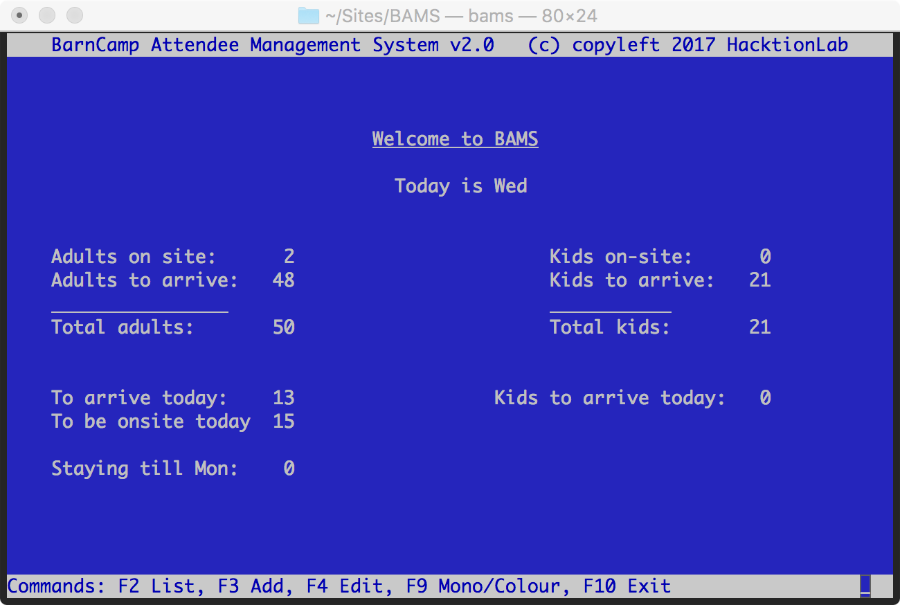
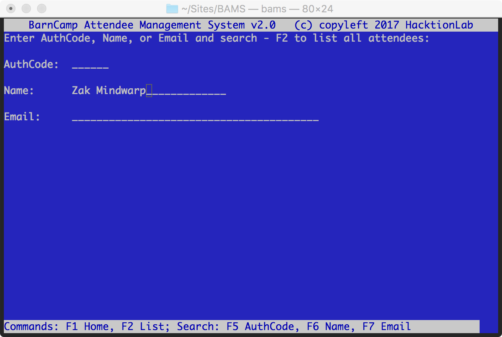
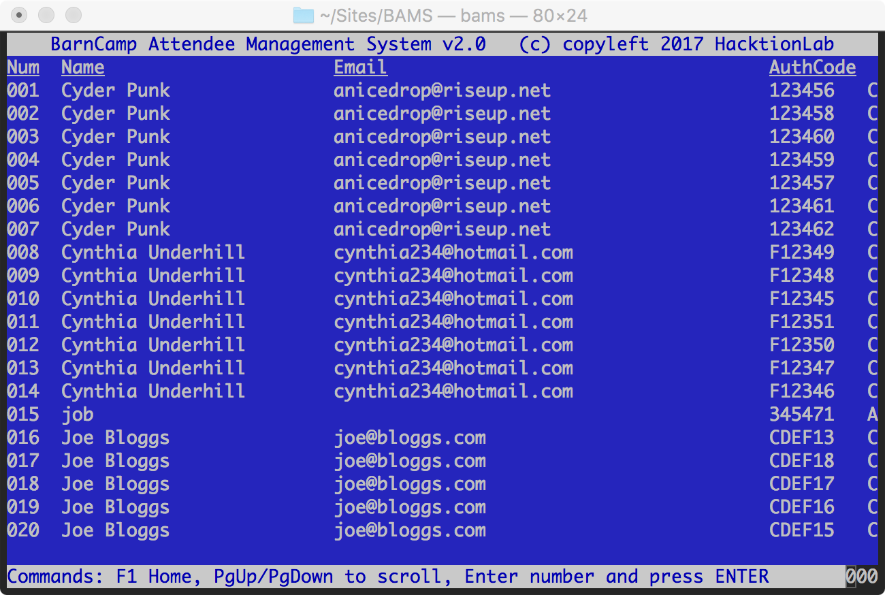
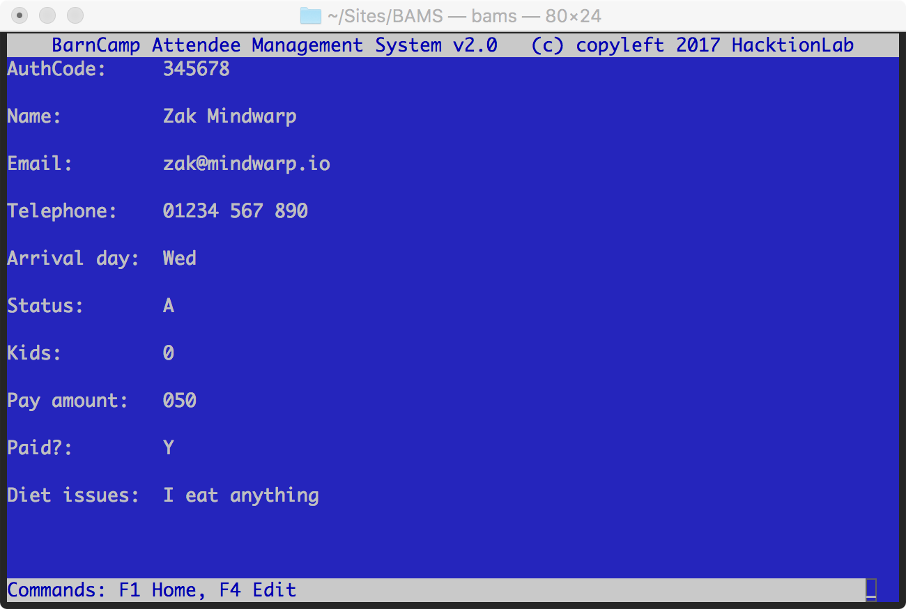
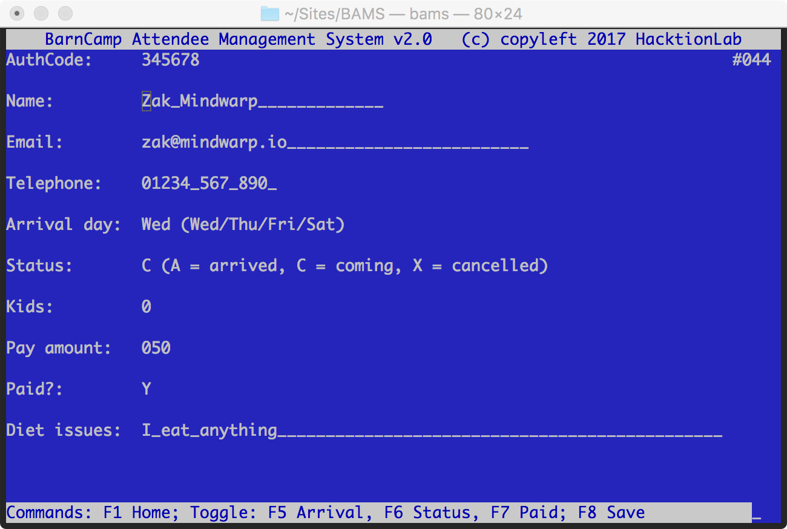
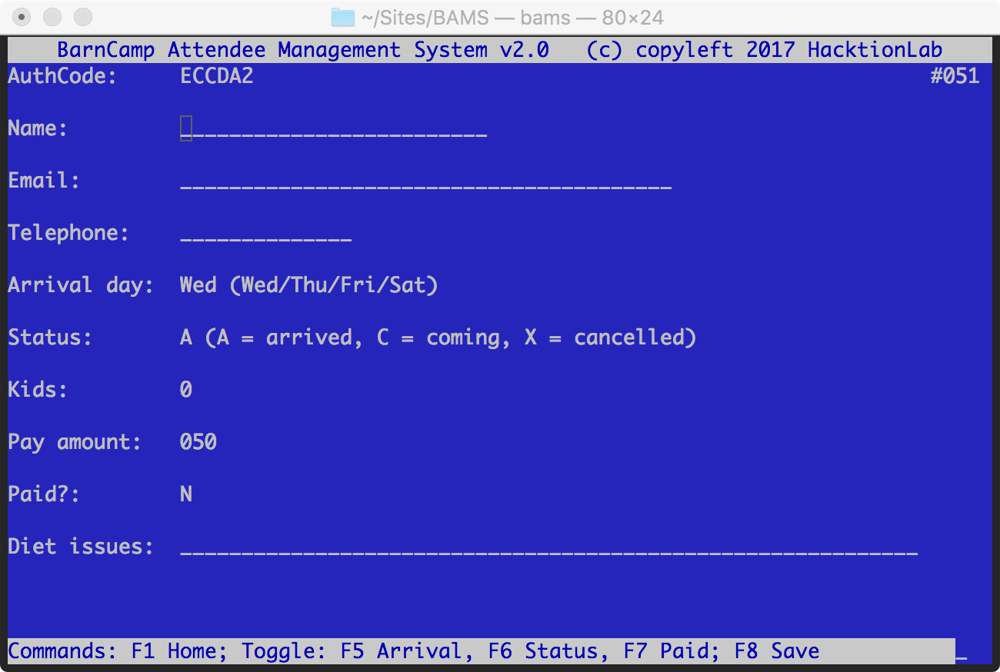

# BAMS
The BarnCamp Attendee Management System

A system for managing the Welcome Desk at [BarnCamp](https://barncamp.org.uk) written in GNU COBOL.




## Compiling

Firstly, Good Luck!  You'll need the latest version 2.0-rc2 of [GNU COBOL](https://sourceforge.net/projects/open-cobol/) to compile this code.  Version 1.x of the compile will not work as BAMS uses a number of ISO COBOL 2002 and ISO COBOL 2014 extensions.

I can compile it on Mac OS X 10.12 and under Debian GNU/Linux (kernel 3.16.0-4-amd64) with:

```
cobc -x -free -std=default -o bams bams.cbl createAuthCode.cbl ListAttendeesScreen.cbl
```

BAMS is great

I had huge problems trying to get it to compile under Linux (but not under OS X) using the modular approach I'd originally intended.  The original code using the COBOL ENTRY points can be found in the file Attenees.cbl and it's accompanying test both in the entry-method directory.

To get version 2.0 of GNU COBOL compiler (cobc), download it from https://sourceforge.net/projects/open-cobol/files/gnu-cobol/2.0/ (rc2 is the latest at the time of typing), untar/zip it, and (on Linux) do:
```
./configure --with-curses=check --prefix=/usr/local CPPFLAGS=-I/usr/local/include/ LDFLAGS=-L/usr/local/lib
make
make install
```
Check which version is running with:
```
which cobc
```
This should be the version '/usr/local/bin/cobc' but if it isn't, replace 'cobc' in the command lines to compile with '/usr/local/bin/cobc'.

## Setting up data

First compile the data importer:
```
cobc -std=default -x -free ImportAttendees.cbl
```
Now run it to import the test data:
```
./ImportAttendees bams-test-data.csv test-data.dat
```
Or real data:
```
./ImportAttendees <name of real csv file> attendees.dat
```
## Build script

The file build.sh can be used to build all four programs in one got.  Try it!

## Run BAMS

Just run it with:
 ```
 ./bams
 ```

or optionally with a specific data file:
 ```
 ./bams path/to/data-file.dat
 ```

If you find that the function keys don't seem to do what they should, check that they haven't been captured by your window manager or terminal emulator. For example in MATE terminal, F10 brings up the emulator menu so you can't exit the application.

# Using BAMS

BAMS is a classic console application that strives to use the keyboard to do things as much as possible.  To this end a set of different function and other control keys on a standard PC or Macintosh keyboard has been chosen to help you navigate the program.  We have striven to make the same key do the same kind of thing on every screen where it's used.   The operations of the keys are as follows:

* F1 - Return to the BAMS Home Screen (available on all screens except from the Home Screen itself).
* F2 - Enter/Search for and View a given attendee already in the system.
* F3 - Add a new attendee to the system.
* F4 - Edit a given attendee already in the system.
* F5 - Toggle the arrival day of an attendee between Wednesday, Thursday, Friday and Saturday.
* F6 - Toggle the attendance status of an attendee between Coming, Arrived or Cancelled.
* F7 - Toggle the payment status of an attendee between Paid and Not Paid.
* F8 - Save and changes to the current attendee selected.
* F9 - Cycle through a number of different foreground text colours (default is green).
* F10 - Exit BAMS from the Home Screen and return to the operating system.
* PgUp/PgDown - Scroll screen-by-screen through a list of attendees.
* ENTER - Tell BAMS to accept the data in the current input field and input.

All other keys should more or less work as one might expect.

## Home Screen

The home screen looks like this:


In the middle you can see what the day is, and you can immediately tell how many adults and children are attending and how many are on-site already, and are to arrive.  There are three function key options:

* F2 - View a given attendee, which takes you to the Enter Authcode Screen.
* F3 - Add a new attendee, which takes you to the Add Attendee Screen.
* F10 - Exit BAMS and return to the operating system.

## Enter Authcode Screen

Pressing F2 from the Home Screen will take you to the Enter Authcode Screen, which looks like this:


You have three options:

* Type in the desired Authcode and press enter.  If the Authcode entered exists, you'll arrive at the View Attendee screen.  The input field is not case sensitve and the Authcode can therefore be entered in upper or lower case.
* F1 - go back to the Home Screen
* F2 - Rather than enter the Authcode, go to the List Attendees Screen to search for it

## List Attendees Screen
This screen shows a list of all attendees and allows you to page through them and then choose one to view.


Use the PgUp and PgDn (page up and page down) keys on your keyboard to scroll through the list a page at a time until you find the attendee youre looking for.  

When you spot them, look for the number under the leftmost (Num) column and enter this using the keyboard and then press ENTER; you'll be taken to the View Attendee Screen for that attendee.  Note that although the field has three 0s, it will accept you typing one or more digits.

Press F1 to return to the BAMS Home Screen.

## View Attendee Screen
This screen shows the attendee's details:


If you'd like to edit the details, press F4 to go to the Edit Attendee Screen.

## Edit Attendee Screen
You'll arrive here from the List Attendees Screen or Enter Authcode Screen, and you'll see something like this:


You can edit most of the data pertaining to the attendee by navigating the fields with the cursor keys.  Lef and right work in a field, and up and down will move you between fields.  Note that typing wherever the cursor is will OVERWRITE the character under the cursor.  So for example, to change Zak to Zek, move the cursor to the 'a' and type 'e'.

There are three fields that have special function keys used to edit them.  These are:

* Arrival day - use the F5 key to toggle between Wednesday, Thursday, Friday and Saturday.
* (Arrival) Status - use the F6 key to toggle between C for coming, A for arrived, or X for Cancelled.
* Payment Status - use the F7 key to toggle between Y for yes, or N for no.

Please complete as much of the data as possible before pressing the F8 key to save.  On hitting F8, you'll be returned to the View Attendee Screen.  If you don't save, any changes you make will be lost.

Other function key options work as they do on the other screens.

## Add Attendee Screen
This is effecitvely the same screen as the Edit Screen, but a new attendee is created with a unique AuthCode.  See the screenshot below, but otherwise read the Edit Attendee Section for details of how to use it.

Note: if you do not Save the new attendee any data you've entered will be lost!



# Operations FAQ

Here's a list of what to do in certain situations.

## Someone arrives and says they have booked

* Welcome them.  
* From the Home Screen go to the Authcode Screen by pressing F2.  
* If the person has brought their authcode with them, you can type it in and press ENTER on this screen to bring up their record.
* If they are a new arrival their arrival status should be C.  If they paid in advance, their payment status (Paid?) will be Y.
* Edit their record by pressing F4.
* Press the F5 key until their Arrival Day matches today.
* Press the F6 key until their Status is A.
* If they are to pay on site, because they didn't pay in advance, press the F7 key to toggle Paid? to read Y.  Then edit the Pay amount field to be the amount they paid.
* Make any other changes necessary and hit F8 to save.

## Someone arrives but hasn't booked

* Slap them, gently.
* Welcome them.  
* From the Home Screen go to the Add Screen by pressing F3.  
* Press the F5 key until their Arrival Day matches today.
* Press the F6 key until their Status is A.
* Press the F7 key to toggle Paid? to read Y.  
* Then edit the Pay amount field to be the amount they paid.
* Add any other details required and hit F8 to save.

## Someone phones up and says they've cancelled

* Comiserate with them.  
* From the Home Screen go to the Authcode Screen by pressing F2.  
* If the person knows their authcode, you can type it in and press ENTER on this screen to bring up their record.
* Their arrival status should be C.  If they paid in advance, their payment status (Paid?) will be Y.
* Edit their record by pressing F4.
* Press the F6 key until their Status is X.
* If they have already paid, say that they will get the many back, but a week or so after BarnCamp is over.
* Hit F8 to save.

## Someone phones up and says they are turning up on a different day to what they thought

* From the Home Screen go to the Authcode Screen by pressing F2.  
* If the person knows their authcode, you can type it in and press ENTER on this screen to bring up their record.
* Their arrival status should be C.
* Edit their record by pressing F4.
* Press the F5 key until their Arrival Day matches the new day they think they will arrive on.
* Make any other changes necessary and hit F8 to save.

# Other Utilities

Here are some supplimentary utilities also included.

## BarnCampReport

Produces some useful stats about how many people are on site and when, what their diets are, etc.

Compile this with:
```
cobc -std=default -x -free BarnCampReport.cbl Attendee.cbl
```

## Export Utility

This tool allows you to re-export the data from BAMS to a CSV file for use in other programs.

Compile this with:
```
cobc -std=default -x -free ExportAttendees.cbl
```

And run with:
```
./ExportAttendees <attendees.dat file> <output.csv file>
```
